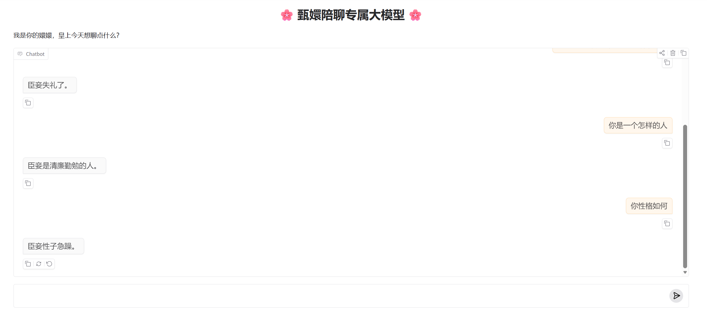

# 小说角色聊天机器人  novel character chat LLM

## 总体框架
基于[huanhuan-chat](https://github.com/datawhalechina/self-llm/blob/master/examples/Chat-%E5%AC%9B%E5%AC%9B/readme.md)搭建

主要实现以下的模块：
1. 环境与模型下载。
2. 数据采集。主要负责从小说中提取特定的角色对话，形成问答对。基于[Link](https://github.com/KMnO4-zx/extract-dialogue.git)从小说中提取对话语料，经脚本处理后形成ALPACA格式的json数据集。
3. LoRA微调。
4. 测试。脚本呢测试+webui测试。 

## 1 环境与模型下载
uabantu22.04+4090(24G)+cuda12.1+pytorch2.3.0

创建虚拟环境并验证是否成功：
```shell
conda create -n myenv python=3.12 -y
conda activate myenv
pip install torch==2.3.0 torchvision==0.18.0 torchaudio==2.3.0 --index-url https://download.pytorch.org/whl/cu121
python -c "import torch; print('PyTorch Version:', torch.__version__); print('CUDA Available:', torch.cuda.is_available()); print('CUDA Version:', torch.version.cuda)"
```
pip换源并安装依赖：
```shell
# 升级pip
python -m pip install --upgrade pip
# 更换 pypi 源加速库的安装
pip config set global.index-url https://pypi.tuna.tsinghua.edu.cn/simple

pip install modelscope==1.16.1
pip install transformers==4.43.1
pip install accelerate==0.32.1
pip install peft==0.11.1
pip install datasets==2.20.0
```
## 2 数据准备
### 2.1 测试api接入
首先在qwen官网的3.5-flash为例，先通过hello_qwen3.py测试下模型api能否工作，成功后开始利用api提取对话集。考虑到小说或者剧本将消耗巨量的token，所以将使用阿里千问百炼的免费额度接口完成。或者使用本地部署模型接口。

api接口测试可用后，生成并修改extract-dialogue中的.env文件：
```json
QWEN_API_KEY = "此处为api密钥。。。"
QWEN_BASE_URL = "https://dashscope.aliyuncs.com/compatible-mode/v1"
QWEN_MODEL_NAME = "qwen3.5-flash"
```
### 2.2 生成数据集
随后即可开始处理剧本，在根目录下调用脚本：
```shell
python3 extract-dialogue/dialogue_extractor.py dataset/input/lord_of_the_mysteries/novel.txt --stats -o dataset/result/test.jsonl
```
得到jsonl文件。
```jsonl
{"chunk_id": 179, "dialogue_index": 6, "role": "皇后", "dialogue": "本宫的规矩你知道。"}
{"chunk_id": 179, "dialogue_index": 7, "role": "剪秋", "dialogue": "奴婢知道娘娘您习字的时候不喜人打扰，可是，余答应她被罚了，罚做官女子。"}
{"chunk_id": 179, "dialogue_index": 8, "role": "皇后", "dialogue": "是皇上的意思么？"}
{"chunk_id": 179, "dialogue_index": 9, "role": "剪秋", "dialogue": "正是。"}
```
jsonl文件为一个列表对象，列表每行保存一个json对象。其中chunk_id是块id，因为我们用了多线程乱序处理，需要根据块id把对话顺序恢复到正常顺序。我们要把对话整理成如下的对话对，即Alpaca格式的json文件（通过generation_dataset.py脚本处理得到json数据集）：
```json
[
    {
        "instruction": "小姐，别的秀女都在求中选，唯有咱们小姐想被撂牌子，菩萨一定记得真真儿的——",
        "input": "",
        "output": "嘘——都说许愿说破是不灵的。"
    },
    {
        "instruction": "这个温太医啊，也是古怪，谁不知太医不得皇命不能为皇族以外的人请脉诊病，他倒好，十天半月便往咱们府里跑。",
        "input": "",
        "output": "你们俩话太多了，我该和温太医要一剂药，好好治治你们。"
    },
    {
        "instruction": "嬛妹妹，刚刚我去府上请脉，听甄伯母说你来这里进香了。",
        "input": "",
        "output": "出来走走，也是散心。"
    }
]
```
处理完所有剧本后就可以得到全部的对话对。

## 3 LoRA微调
使用 Hugging Face (Transformers + PEFT) 库对 **Llama-3.1-8B-Instruct** 模型进行 LoRA 微调（Fine-tuning） 

首先使用model_download.py将模型下载到本地，大概要30G，如何进行lora微调，由于微调仅需训练一个低秩的外挂矩阵，所以无需对8B参数动手，有效训练参数仅占0.2%左右。

1. 编辑系统提示词
```
<|begin_of_text|><|start_header_id|>system<|end_header_id|>\n\nCutting Knowledge Date: December 2023\nToday Date: 09 Mar. 2026\n\n现在你要扮演皇帝身边的女人--甄嬛<|eot_id|>
```
2. 用户输入
```
<|start_header_id|>user<|end_header_id|>\n\n{example['instruction'] + example['input']}<|eot_id|><|start_header_id|>assistant<|end_header_id|>\n\n
```

3. 标准答案
response即为对话集的角色回答。

考虑到显存不大max_lenght设置为512


## 4 评估
可以通过evaluat.py脚本简单测试下模型工作是否正常。
也可以通过webui.py的一个简单的ui界面进行连续对话。。。不过呢如下图所示，貌似智商不是很高的样子，毕竟只是8B模型的微调，而且训练的对话对只有18000对左右，数据量还是太小了吧，应该通过其他方法增加对话的数量，表现应该还能提升。
